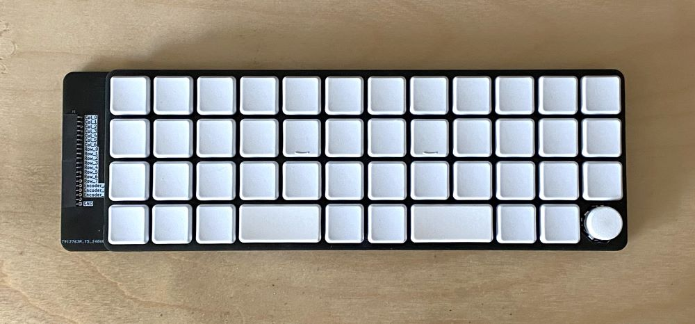
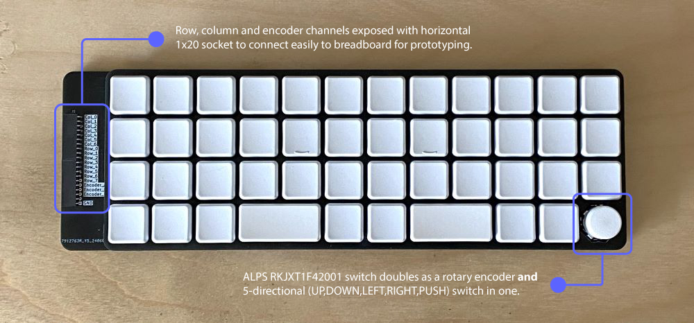
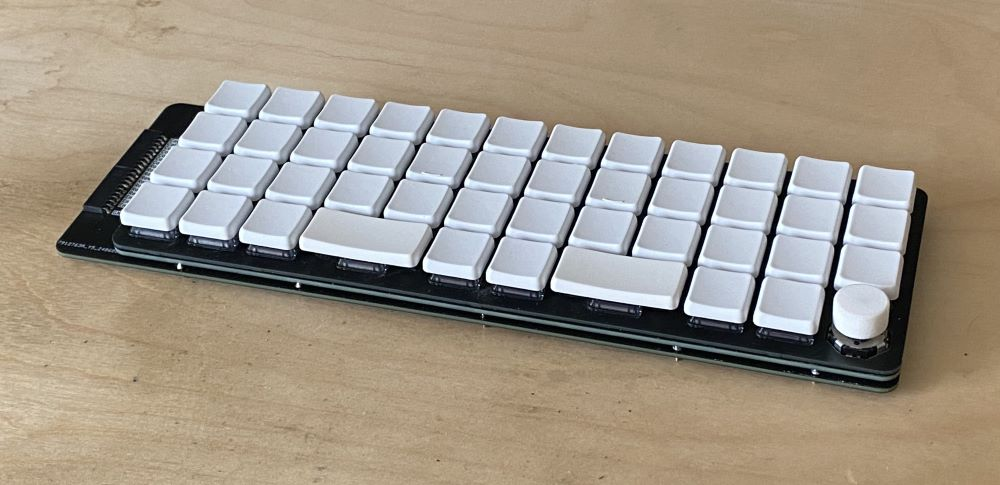
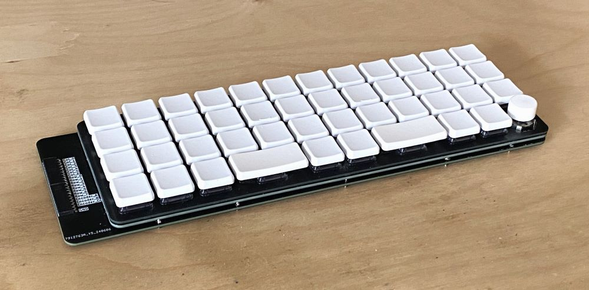
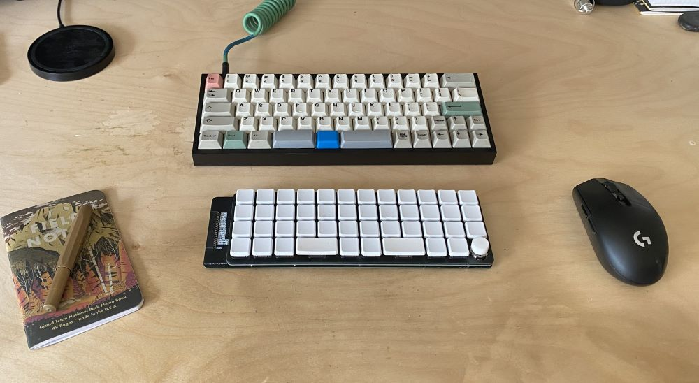
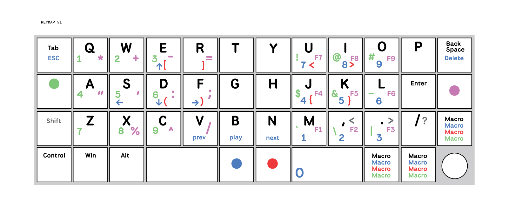

# Ground Control 40 Dev Board

The Ground Control 40 Dev Board is an **open source** 40% ortho-linear keyboard shell with exposed pin header, designed for rapid prototyping with any micro-controller of your choice.

## Features

- Combined Rotary Encoder + 5-direction multi-switch in one (Alps RKJXT1F42001 switch)
- Split spacebar ortholinear 40% layout
- Low-profile (Choc v1 Switches)
- Folded switch Matrix to minimize required I/O pins
- HotSwap sockets

## Required Parts

⚠ Warning: Do not attempt to use any keycap profile other than CFX. It will not work. The spacing is designed specifically for this profile (which is square, not rectangular).

- 45 x Choc v1 switches
- 45 x Choc v1 hotswap sockets
- 43 x CFX 1u Keycaps
- 2 x CFX 2u Keycaps
- 2 x Choc v1 2u stabilizers
- 1 x Alps RKJXT1F42001
- 45 x Onsemi 1N4148WS diodes
- 14 x Mill-Max 1440-4-00-15-00-00-03-0 nail head pins
- 14 x Harwin H3185-05 Pin Socket
- 2 x Samtec SQT-110-01-FM-S-RA 1x10 horizontal pin socket
- 2.8-3mm thick silicone pad or other spacer of this thickness

## Ordering

PCB's are ordered using the gerber files in the `gerbers` directory. 

PCB's can be ordered through JLCPCB. The minimum order volume is 5 pieces per board, and there are three boards. The cost is actually quite reasonable.

Choc v1 switches available through various vendors depending on your preferred flavor.

CFX keycaps available from Chosfox and various other vendors.

Additional electronics components can all be found on Mouser. Search using the part numbers listed above.

## Assembly

### Required Tools

- Soldering Iron
- Hot Air Gun (for diodes)
- 150 grit sandpaper
- Soldering wire
- Soldering paste

### Order of Operations

The design consists of three PCB's.

**Mounting Plate**: Stabilizers and Switches are installed here
**Switch Plate**: Holds the hotswap sockets, diodes and nail-head pins
**Main Plate**: Hold the Alps multi-switch, horizontal pin socket and board to board pin sockets

1. Install the parts that belong to each plate onto them before you attempt to combine the plates or install Choc switches.

2. After each plate is prepared, assemble the Switch and Main plates together.  You will want to place 2.8-3mm spacers between the switch and main plate. I used cut up pieces of a silicone pad and glued them in place on the main plate.

3. Using a piece of 150 grit sandpaper, sand the left and right sides of each switch hole on the mounting plate. This will ensure that the Choc v1 switches can snap into place without damaging them (their little clips are more fragile than a standard switch)

4. Install the stabilizers in the mounting plate.

5. Install the switches into mounting plate one at a time. Start in the corners and then middle. Use an alternating pattern to give equal pressure.

## Recommended KeyMap

## Customization

If you wish to modify this design, I have included the Kicad files in the `kicad` directory. And the Fusion 360 files in the `fusion` directory.